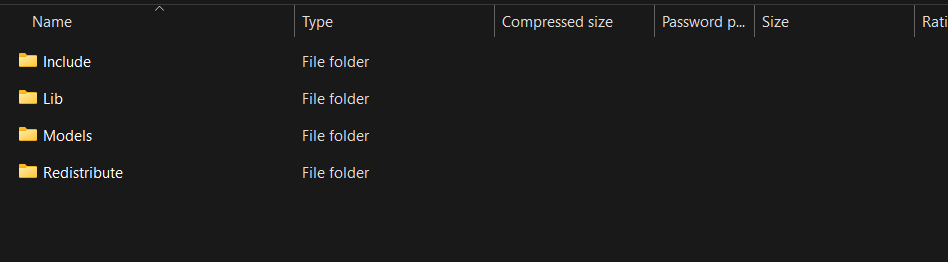
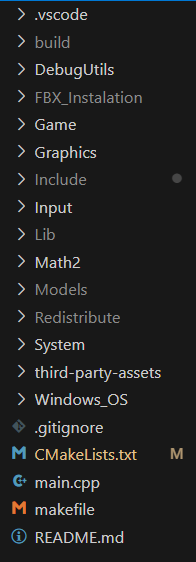

# Malenia-BossFight 

## Disclaimer

***THIS PROJECT IS STILL IN THE MAKING***
***THIS PROJECT CAN ONLY RUN ON WINDOWS SINCE IT USES DIRECTX 11***

Make sure you have either a PS4 or a PS5 controller connected when running the project.

## PreRequisites

In order to build this project you need to have installed

 - [git](https://git-scm.com/downloads/win)
 - [vcpkg](https://learn.microsoft.com/en-us/vcpkg/get_started/get-started?pivots=shell-powershell) 
 - [CMake](https://cmake.org/download/)
 - [Visual Studio Tools](https://visualstudio.microsoft.com/vs/community/)

**IMPORTANT:**
When downloading **Visual Studio Tools** make sure during installation to have included, at least, **Desktop development with C++** and inside this workload you have **MSVC compiler, Windows 10/11 SDK and C++ CMake tools for Windows** selected.

## Build The Project

### Step 1 
Open a command prompt and navigate to the directory where you want to have the project. Once there run the command

`git clone https://github.com/NunoSilva04/Malenia-BossFight.git`

### Step 2
Download the third party assets zip folder from the git repository [release page](https://github.com/NunoSilva04/Malenia-BossFight/releases/tag/v1.0)


### Step 3
Extract the zip anywhere you like and copy the absolute file path. This will be your **Assets Path**.

Example:
```
C:/example/path/to/third-party-assets 
```

**Make sure you replace all instances of `\` for `/` in your file path**

**IMPORTANT:**  
The project expects all third party assets to be inside a folder called `third-party-assets`.  

- If extracting the zip creates a bunch of files directly on your desktop (or other location) instead of a folder, **manually create a folder named `third-party-assets`** and move all extracted contents into it. 
- In the end you should have something like this 



- **Don't forget to copy the file path and replace all instances of `\` for `/`**

### Step 4

Open the project that you had cloned back in **Step 1** and go to **third-party-assets**. Open the file **portfile.cmake** and replace all instances of **pathToAssets** with the **Assets Path you copied in Step 3**

### Step 5

Open a command prompt and navigate all the way until the **vcpkg** folder 

Example:
```cmd
C:\vcpkg>
```

### Step 6

Run the command `vcpkg install third-party-assets --overlay-ports=C:\path\to\your\project\third-party-assets`

**IMPORTANT:** 
- Here the argument in `--overlay-ports` is not the **Assets Path**. It's the path that contains `portfile.cmake` and `vcpkg.json`. These files will be inside the project that you cloned back in **Step 1** inside a folder called **third-party-assets**

- Note that here we are using `\` instead of `/`. 

After the command executes you should see inside your **vcpkg folder** a new folder called **packages** and inside it another folder called
**third-party-assets_x64-windows**. Enter that folder and copy that file path.

Example: 
```
"C:/.../vcpkg/packages/third-party-assets_x64-windows"
```

**IMPORTANT:**
Note that here we are now using `/` instead of `\`. 

### Step 7

Go back to the project folder that you had cloned back in **Step 1** and open **CMakeLists.txt**. Find the command 
```cmake
set(THIRD_PARTY_ASSETS_DIR "C:/vcpkg/packages/third-party-assets_x64-windows") 
```

and replace **"C:/vcpkg/..."** with the file path that you had previously copied in **Step 6**

### Step 8

Create a new directory with a name of your choice inside the project folder you cloned back in **Step 1**. After that open a command prompt and navigate all the way where the **CMakeLists.txt** file is and run the command `cmake -B <directory_name>`
- **Note:** Here `<directory_name>` is the name you gave to the directory you just created. In the picture below I named it build



Your folder structure should look something like this

### Step 9

Once finished run the command `cmake --build <directory_name>`
- **Note:** Here `<directory_name>` is the name you gave to the directory you created back in **Step 8**.

### Step 10

The **bossFight.exe** will be located inside the **<directory_name>/Debug folder**. Navigate all the way where **bossFight.exe** is located and run the command `bossFight.exe` or double click the **bossFight.exe** directly inside the folder
- **Note:** Here `<directory_name>` is the name you gave to the directory you created back in **Step 8**.