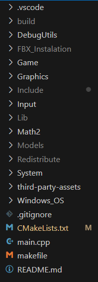

# Malenia-BossFight 
# Building Instructions

In order to build this project you need to have installed 
vcpkg (https://learn.microsoft.com/en-us/vcpkg/get_started/get-started?pivots=shell-powershell) 
and cmake (https://cmake.org/download/)

1. Download the third party assets zip folder from the git repository (https://github.com/NunoSilva04/Malenia-BossFight/releases/tag/v1.0)

2. Extract the zip anywhere you would like and copy the file path (C:\example\path\to\third-party-assets)

3. Open the project and go to third-party-assets/portfile.cmake and replace any instance of pathToAssets to your new file path

4. Open a command prompt and navigate all the way until the vcpkg folder 
Example : C:\vcpkg>

5. Run the command vcpkg install third-party-assets --overlay-ports=C:\example\path\to\third-party-assets
After the command executes you should see inside your vcpkg folder a new folder called packages and inside it another folder called
third-party-assets_x64-windows. Enter that folder and copy that file path.

6. Go back to the project folder and go to CMakeLists.txt. 
Find the command set(THIRD_PARTY_ASSETS_DIR "C:/vcpkg/packages/third-party-assets_x64-windows") and replace "C:/vcpkg/..."
with the file path that you had previously copied

7. Create a directory (for example build) in the main project folder. After that run the command cmake -B <directory_name>
Your folder should look something like this 

8. Once finished run the command cmake --build <directory_name>

9. The .exe will be located inside the <directory_name>/Debug folder. For that just navigate all the way until where the .exe is located and run the command bossFight.exe